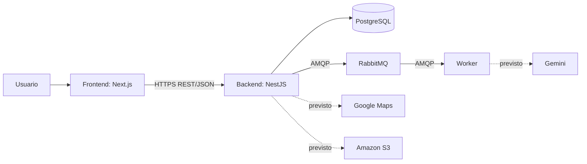

# Arquitectura

## Estado de implementación

El backend contiene el scaffold de NestJS, `ConfigModule` global, validación de
variables de entorno, conexión a PostgreSQL con TypeORM, infraestructura de
migraciones, pruebas unitarias/e2e, e infraestructura de colas y worker base
(F12, #34): RabbitMQ, un publisher (`MensajeriaService`), un worker como
proceso separado y un trabajo de ejemplo de punta a punta. No hay entidades ni
módulos de negocio, autenticación ni trabajos funcionales sobre la cola
(generación de planes, notificaciones) implementados todavía.

## Componentes



| Componente           | Responsabilidad                                 | Estado                          |
| -------------------- | ----------------------------------------------- | ------------------------------- |
| Frontend             | Interfaz web y consumo de API                   | Repositorio independiente       |
| Backend              | API REST, negocio, autenticación y autorización | Fundaciones configuradas        |
| PostgreSQL / TypeORM | Persistencia relacional                         | Integración local y migraciones |
| RabbitMQ y worker    | Trabajos asíncronos                             | Infraestructura y trabajo de ejemplo implementados (F12); sin trabajos funcionales |
| Google Maps          | Geocodificación, distancias y lugares           | Integración prevista            |
| Gemini               | Generación de planes y sugerencias              | Validada por spike (#32); integración productiva prevista |
| Amazon S3            | Imágenes de actividades y lugares               | Integración prevista            |

## Reglas de dependencia

- El frontend se comunica con el backend mediante HTTPS y JSON.
- El frontend no accede a PostgreSQL, RabbitMQ ni Gemini.
- La API no debe ejecutar en el request trabajos de latencia alta: la
  infraestructura de colas ya existe (F12) — los trabajos de latencia alta
  (generación de planes, notificaciones, sincronizaciones, reportes) van por
  `MensajeriaService.publicar()` cuando se implementen.
- Controladores HTTP coordinan entrada y respuesta; no concentran SQL ni reglas
  de negocio.
- La configuración se obtiene mediante `ConfigService`, no desde `process.env`
  fuera de la capa de configuración.

## Colas y trabajos asíncronos

Infraestructura base implementada en F12 (#34) — `src/mensajeria/`.

### Topología

```text
smartplan.jobs (exchange, direct)
    └─ example.execute → smartplan.jobs.example (cola principal)

smartplan.jobs.retry (exchange, direct)
    ├─ example.execute.retry.1 → smartplan.jobs.example.retry.1 (TTL: demoras[0], DLX de vuelta a smartplan.jobs)
    └─ example.execute.retry.2 → smartplan.jobs.example.retry.2 (TTL: demoras[1], DLX de vuelta a smartplan.jobs)

smartplan.jobs.dlx (exchange, direct)
    └─ example.execute.dlq → smartplan.jobs.example.dlq (DLQ, reposo final)
```

Reintentos vía TTL + Dead Letter Exchange (no plugins): cuando un trabajo
falla con un error reintentable y quedan intentos, el worker republica a la
cola de retry correspondiente al intento actual; al vencer el TTL, RabbitMQ lo
devuelve automáticamente a la cola principal. Agotados los intentos
(`RABBITMQ_MAX_INTENTOS`, default 3) o ante un error permanente, el trabajo va
directo a la DLQ.

**Semántica: at-least-once.** El mensaje original se confirma (ack) solo
después de que el trabajo terminó bien, o de que la republicación a retry/DLQ
se confirmó como exitosa con el broker — nunca antes. Si el worker se cae a
mitad de un trabajo, RabbitMQ reencola automáticamente al reconectar: un
trabajo puede ejecutarse más de una vez. Los manejadores deben tolerarlo; no
hay deduplicación global.

**Durabilidad, no alta disponibilidad.** Colas durables y mensajes
persistentes protegen ante reinicios de proceso y permiten el reencolado
automático ante desconexión, pero no equivalen a alta disponibilidad: con un
solo nodo de RabbitMQ (sin clustering, fuera de alcance), la pérdida completa
del nodo puede perder mensajes en cola.

Detalle de diseño (contrato del sobre, clasificación de errores, ACK/NACK,
logging) en el código de `src/mensajeria/` y en `SEGUIMIENTO.md` → Decisiones.

## Entornos previstos

| Entorno    | Backend                           | Base de datos                    | Observación                        |
| ---------- | --------------------------------- | -------------------------------- | ---------------------------------- |
| Desarrollo | Local, puerto definido por `PORT` | Docker local o instancia externa | La plantilla usa 3001 por defecto; el 3000 queda para el frontend. |
| Prueba     | Ejecución de Jest/e2e             | Base aislada `<DB_NAME>_test`    | El setup e2e la crea y vacía.      |
| Producción | Railway previsto                  | PostgreSQL administrado previsto | `main` representa producción.      |

La arquitectura futura requiere validación del equipo antes de agregar
dependencias, credenciales o infraestructura. Consultá también la
[skill de arquitectura](../skills/05-arquitectura/SKILL.md).
