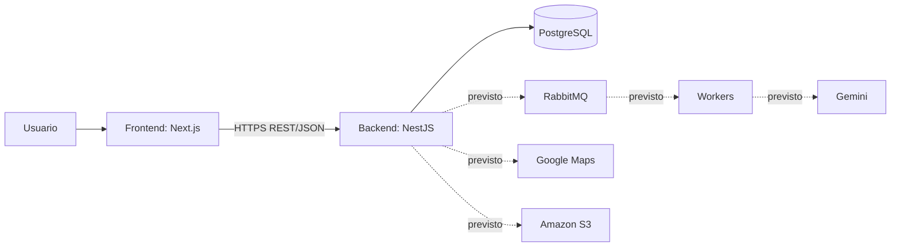

# Arquitectura

## Estado de implementación

El backend contiene el scaffold de NestJS, `ConfigModule` global, validación de
variables de entorno, conexión a PostgreSQL con TypeORM, infraestructura de
migraciones y pruebas unitarias/e2e. No hay entidades ni módulos de negocio,
autenticación ni colas implementados.

## Componentes

| Componente           | Responsabilidad                                 | Estado                          |
| -------------------- | ----------------------------------------------- | ------------------------------- |
| Frontend             | Interfaz web y consumo de API                   | Repositorio independiente       |
| Backend              | API REST, negocio, autenticación y autorización | Fundaciones configuradas        |
| PostgreSQL / TypeORM | Persistencia relacional                         | Integración local y migraciones |
| RabbitMQ y workers   | Trabajos asíncronos                             | Arquitectura prevista           |
| Google Maps          | Geocodificación, distancias y lugares           | Integración prevista            |
| Gemini               | Generación de planes y sugerencias              | Validada por spike (#32); integración productiva prevista |
| Amazon S3            | Imágenes de actividades y lugares               | Integración prevista            |

## Reglas de dependencia

- El frontend se comunica con el backend mediante HTTPS y JSON.
- El frontend no accede a PostgreSQL, RabbitMQ ni Gemini.
- La API no debe ejecutar en el request trabajos de latencia alta: la generación
  de planes, notificaciones, sincronizaciones y reportes se diseñarán como
  procesamiento asíncrono cuando se incorpore la infraestructura.
- Controladores HTTP coordinan entrada y respuesta; no concentran SQL ni reglas
  de negocio.
- La configuración se obtiene mediante `ConfigService`, no desde `process.env`
  fuera de la capa de configuración.

## Entornos previstos

| Entorno    | Backend                           | Base de datos                    | Observación                        |
| ---------- | --------------------------------- | -------------------------------- | ---------------------------------- |
| Desarrollo | Local, puerto definido por `PORT` | Docker local o instancia externa | La plantilla usa 3001 por defecto; el 3000 queda para el frontend. |
| Prueba     | Ejecución de Jest/e2e             | Base aislada `<DB_NAME>_test`    | El setup e2e la crea y vacía.      |
| Producción | Railway previsto                  | PostgreSQL administrado previsto | `main` representa producción.      |

La arquitectura futura requiere validación del equipo antes de agregar
dependencias, credenciales o infraestructura. Consultá también la
[skill de arquitectura](../skills/05-arquitectura/SKILL.md).
