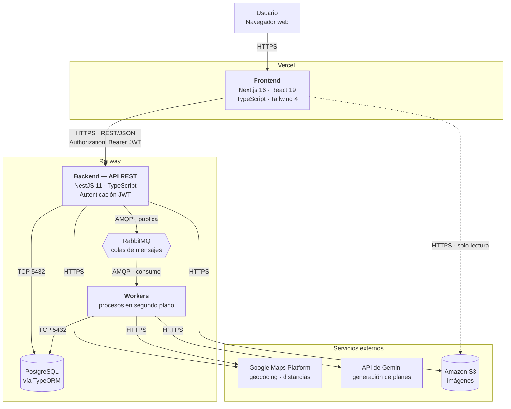

# SmartPlan — Arquitectura del sistema

> Núcleo compartido. Este archivo es idéntico en `SmartPlan-front` y `SmartPlan-back`.
> Si lo modificás, replicá el cambio en el otro repositorio.

## Tipo de aplicativo

**Aplicación web responsive.** No hay app móvil nativa ni híbrida: se accede desde
el navegador, tanto de escritorio como de celular.

Es coherente con el objetivo general definitivo, que habla de "desarrollar una
aplicación web", y con el stack elegido (Next.js del lado del cliente, API REST
del lado del servidor).

## Diagrama

> La línea punteada del frontend a S3 marca que es un acceso secundario (lectura
> de imágenes), no parte del camino principal de la aplicación.

## Componentes y tecnologías

| Componente | Lenguaje | Framework / motor | Responsabilidad |
|---|---|---|---|
| Frontend | TypeScript 5 | Next.js 16 (App Router), React 19, Tailwind CSS 4 | Interfaz de usuario, renderizado, consumo de la API |
| Backend | TypeScript 5.7 | NestJS 11 | API REST, reglas de negocio, autenticación y autorización |
| Base de datos | SQL | PostgreSQL (ORM: TypeORM 0.3, driver `pg`) | Persistencia de las ~30 entidades del dominio |
| Cola de mensajes | — | RabbitMQ | Desacopla el procesamiento asíncrono de la respuesta HTTP |
| Workers | TypeScript | NestJS (consumidores) | Tareas en segundo plano y programadas |
| Almacenamiento de objetos | — | Amazon S3 | Imágenes de actividades y lugares |
| Geolocalización | — | Google Maps Platform | Direcciones, coordenadas y distancias entre actividades |
| Generación de planes | — | API de Gemini | Armado de planes personalizados y sugerencias |

## Comunicación entre componentes

| Origen | Destino | Protocolo | Detalle |
|---|---|---|---|
| Navegador | Frontend | HTTPS | Renderizado de la aplicación |
| Frontend | Backend | HTTPS, REST/JSON | Token JWT en `Authorization: Bearer <token>` |
| Backend | PostgreSQL | TCP 5432 | A través de TypeORM; nunca SQL crudo desde el controller |
| Backend | RabbitMQ | AMQP | Publica trabajos; responde al cliente sin esperar. Exchange direct `smartplan.jobs`, at-least-once, hasta 3 intentos, DLQ por tipo |
| RabbitMQ | Workers | AMQP | Los workers consumen y procesan |
| Backend / Workers | Google Maps | HTTPS REST | API key por variable de entorno |
| Workers | Gemini | HTTPS REST | API key por variable de entorno |
| Backend | S3 | HTTPS | Subida de imágenes |
| Frontend | S3 | HTTPS | Lectura directa de imágenes |

**Regla de dependencias:** el frontend nunca habla con la base de datos, ni con
RabbitMQ, ni con Gemini. Todo lo que necesite pasa por la API del backend. La
única excepción es la lectura de imágenes desde S3.

## Procesamiento asíncrono

Lo que va por cola en lugar de resolverse dentro del request HTTP:

| Proceso | Disparador | Por qué es asíncrono |
|---|---|---|
| Generación de planes (consultas a Google Maps y Gemini) | El usuario pide un plan (CU17, CU19, CU31) | Depende de APIs externas con latencia variable |
| Envío de notificationes | Eventos del sistema | No debe bloquear la operación que lo origina |
| Actualización de datos externos de actividades y lugares | Tarea programada (CU50) | Volumen alto, sin usuario esperando |
| Limpieza de datos temporales y planes expirados | Tarea programada | Mantenimiento |
| Generación de reportes internos de uso | Tarea programada (CU58) | Agregaciones pesadas |

Ninguno de estos procesos está implementado todavía (F12 solo deja la
infraestructura y un job de ejemplo — ver "Estado de implementación").

**Semántica de entrega: at-least-once.** Un trabajo se confirma (ack) recién
cuando termina de procesarse bien, así que si el worker se cae a mitad,
RabbitMQ vuelve a entregar el mensaje. La consecuencia es que **un trabajo se
puede ejecutar más de una vez**: los manejadores tienen que tolerarlo. No hay
deduplicación global ni exactly-once, y no se planea agregarla — es un costo
desproporcionado para el problema. Cuando un trabajo tenga efectos no
repetibles, la idempotencia se resuelve en el manejador, contra el estado en
PostgreSQL — RabbitMQ transporta trabajos, PostgreSQL mantiene el estado
funcional del dominio.

**Reintentos:** hasta 3 intentos por trabajo (configurable,
`RABBITMQ_MAX_INTENTOS`), con demora entre intentos vía colas de TTL +
Dead Letter Exchange (`RABBITMQ_RETRY_DELAYS_MS`, default `5000,30000`
milisegundos). Agotados los intentos, o ante un error de negocio no
reintentable, el trabajo termina en una Dead Letter Queue (DLQ) — el registro
operativo de trabajos que no se pudieron procesar. Detalle completo de la
topología en `docs/architecture.md`.

**Durabilidad, no alta disponibilidad.** Las colas son durables y los
mensajes persistentes: protegen ante un reinicio del proceso worker/API y
permiten el reencolado automático de AMQP si el worker se desconecta a mitad
de un trabajo. Eso **no** equivale a alta disponibilidad — con un solo nodo
de RabbitMQ (sin clustering ni quorum queues, fuera de alcance), la pérdida
completa del nodo puede perder mensajes en cola. No se planea clustering para
el tamaño actual del proyecto.

## Entornos

### Desarrollo — `localhost`

| Componente | Dónde corre | Puerto |
|---|---|---|
| Frontend | `pnpm dev` | 3000 |
| Backend | `pnpm start:dev` | 3001 |
| PostgreSQL | Docker o instalación local | 5432 |
| RabbitMQ | Docker | 5672 (panel: 15672) |
| Google Maps / Gemini / S3 | Servicios reales, con credenciales de desarrollo | — |

> **Puerto del backend.** Next.js y NestJS usan 3000 por defecto los dos. Ya está
> resuelto: el esquema de entorno fija `PORT` en 3001 y `FRONTEND_URL` en
> `http://localhost:3000`, que es además el único origen que la API autoriza por
> CORS. Si cambiás uno, revisá el otro.

### Producción

| Componente | Plataforma | Costo anual (según Etapa 3) |
|---|---|---|
| Frontend | Vercel | US$ 0 |
| Backend + PostgreSQL | Railway | US$ 240 |
| Google Maps Platform | Google Cloud | US$ 0 |
| API de Gemini | Google Cloud | US$ 120 |
| Dominio | Registrador | US$ 6 |

Total de infraestructura: **US$ 366 / año**.

El despliegue es continuo desde GitHub: Vercel y Railway toman los cambios
mergeados. `main` es la rama de producción.

## Configuración por entorno

Todo lo que cambia entre entornos va por **variables de entorno**, nunca
hardcodeado:

| Variable | Dónde | Qué es |
|---|---|---|
| `NEXT_PUBLIC_API_URL` | Frontend | URL base de la API |
| `DATABASE_URL` | Backend | Conexión a PostgreSQL |
| `JWT_ACCESS_SECRET` | Backend | Secreto de firma del access JWT |
| `JWT_REFRESH_SECRET` | Backend | Secreto separado para refresh JWT |
| `RESEND_API_KEY` | Backend | Envío de recuperación de contraseña |
| `EMAIL_FROM` | Backend | Remitente verificado de Resend |
| `RABBITMQ_URL` | Backend / Workers | Conexión a la cola |
| `RABBITMQ_PREFETCH` | Backend / Workers | Mensajes que el worker toma a la vez |
| `RABBITMQ_MAX_INTENTOS` | Backend / Workers | Intentos totales por trabajo, incluido el primero |
| `RABBITMQ_RETRY_DELAYS_MS` | Backend / Workers | Demoras entre reintentos, en ms, separadas por coma |
| `GOOGLE_MAPS_API_KEY` | Backend / Workers | Clave de Google Maps |
| `GEMINI_API_KEY` | Workers | Clave de Gemini |
| `AWS_*` | Backend | Credenciales de S3 |

`.env` no se commitea. Mantené un `.env.example` con las claves y sin valores.

## Estado de implementación

Lo que ya está decidido **en el código**:

- Frontend: Next.js 16.2.3, React 19, Tailwind 4 — en `SmartPlan-front`
- Backend: NestJS 11 — en `SmartPlan-back`
- Base de datos: PostgreSQL con TypeORM — dependencias `@nestjs/typeorm`,
  `typeorm` y `pg` presentes
- RabbitMQ y worker base (F12, #34): infraestructura de colas y un worker
  como proceso separado (`src/worker.ts`), con un trabajo de ejemplo que
  demuestra el flujo completo (publicación → cola → worker → confirmación) y
  el camino de fallo (reintentos con demora → Dead Letter Queue). **Sin
  trabajos funcionales todavía** — la generación de planes y las
  notificationes siguen previstas, no implementadas.

Lo que está **definido en la documentación pero todavía no en el código**:

- Amazon S3: aparece en la factibilidad técnica y en el plan de
  capacitación, pero no hay dependencias ni módulos. **No figura en el
  cuadro de costos** de la Etapa 3, a diferencia de Vercel, Railway, Google
  Maps y Gemini.
- Trabajos funcionales sobre la cola: generación de planes (CU17/19/31),
  notificationes, sincronización de datos externos, limpieza programada,
  reportes internos — la infraestructura de F12 los deja listos para
  implementarse, pero ninguno está escrito.

API de Gemini: reemplaza a la API de OpenAI que preveía la factibilidad
técnica original (Etapa 3). El spike F10 (#32) validó la integración —
plan generado en español, presupuesto respetado, lugares reales
verificables vía Grounding with Google Maps, costo por generación dentro
de lo presupuestado — pero la integración productiva (CU17, CU19, CU31)
todavía no está escrita; el spike es código de evaluación aislado, no el
motor de recomendación final. Ver `docs/decisions.md` para el detalle de
la decisión.

Si vas a implementar alguno de estos, revisá primero que la decisión siga vigente.
